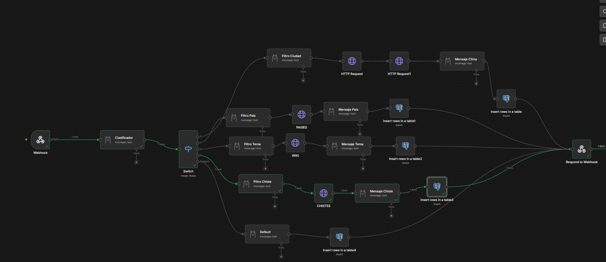
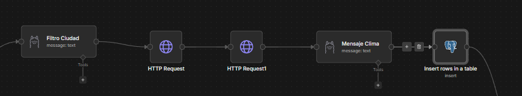
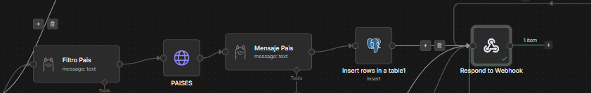
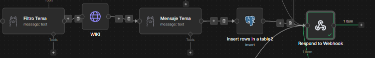
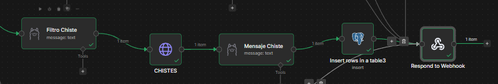
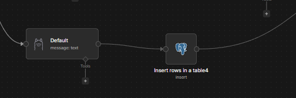

# 🚀 HITO 3: Automatización Inteligente con n8n, Ollama, Qdrant y PostgreSQL

Este repositorio contiene la implementación conjunta de dos proyectos complementarios:
- **Proyecto A (Guillermo Bazán):** Sistema avanzado de **Generación Aumentada por Recuperación (RAG)** que opera 100% en local.
- **Proyecto B (Abdul Hakim):** **Chatbot Multiherramienta** diseñado para detectar intenciones y usar APIs dinámicas basándose en el análisis de Ollama.

Ambos sistemas convergen para brindar soluciones potentes, operando con una arquitectura backend local que garantiza la privacidad de los datos.

## 📋 Índice
1. [Arquitectura del Sistema](#-arquitectura-del-sistema)
2. [Proyecto A: Flujos RAG (Guillermo)](#-proyecto-a-flujos-rag-guillermo)
3. [Proyecto B: Chatbot Multiherramienta (Abdul)](#-proyecto-b-chatbot-multiherramienta-abdul)
4. [Configuración de IA y Modelos](#-configuración-de-ia-y-modelos)
5. [Base de Datos y Persistencia](#-base-de-datos-y-persistencia)
6. [Instalación y Despliegue](#-instalación-y-despliegue)
7. [Pruebas y Validación](#-pruebas-y-validación)

---

## 🏗️ Arquitectura del Sistema

El sistema utiliza una arquitectura de microservicios orquestada por Docker:
- **n8n:** Motor de automatización y orquestación de los flujos RAG.
- **Qdrant:** Base de datos vectorial para almacenamiento y búsqueda semántica de documentos.
- **PostgreSQL:** Almacenamiento relacional para auditoría de consultas y metadatos.
- **Ollama:** Servidor local de inferencia para el LLM y generación de embeddings.

---

## 🔄 Proyecto A: Flujos RAG (Guillermo)

### 1. Ingesta de Documentos (Multiformato)
El flujo de ingesta ha sido diseñado para ser flexible y resiliente:
- **Entrada:** Un Webhook recibe archivos mediante peticiones `POST` (multipart/form-data).
- **Lógica de Ramificación:** Un nodo `Switch` detecta la extensión del archivo (`.pdf` vs `.txt`).
- **Procesamiento:** - Los **PDF** se procesan con el nodo *Extract from File* (PDF).
    - Los **TXT** se convierten de binario a texto plano garantizando la integridad de caracteres.
- **Fragmentación:** Uso de `Recursive Character Text Splitter` para dividir el texto en chunks óptimos.
- **Vectorización:** Los fragmentos se convierten a vectores usando el modelo `nomic-embed-text` y se indexan en Qdrant.


### 2. Consulta y Chatbot de Telegram
El flujo de usuario final optimizado para producción:
- **Telegram Trigger:** Utiliza *Long Polling* para eliminar la necesidad de túneles SSL/HTTPS (como Ngrok).
- **AI Agent (ReAct):** Un agente con razonamiento lógico que utiliza la herramienta de búsqueda en Qdrant.
- **Memoria de Sesión:** Implementación de `Window Buffer Memory` vinculada al `Chat ID` de Telegram, permitiendo conversaciones fluidas y aisladas por usuario.


---

# 🤖 Chatbot IA Multiherramienta - Hito 3 (Proyecto B Abdul Hakim) 

Bienvenido a la documentación del **Chatbot IA Dinámico**, un asistente virtual inteligente construido íntegramente con **n8n**, **Ollama** (modelos LLM locales), y **PostgreSQL**. 

Este proyecto no es un simple bot de respuestas enlatadas; es un sistema avanzado de **agentes** capaz de interpretar la intención del usuario, extraer entidades (nombres de ciudades, personajes, etc.), consultar múltiples APIs de internet en tiempo real, y redactar respuestas 100% conversacionales y humanas.

---

## 🏗️ Arquitectura del Proyecto

El corazón de este chatbot es un flujo de automatización (Workflow) en n8n que procesa las peticiones HTTP (Webhook) enviadas desde un cliente web personalizado. 


*Vista panorámica del flujo completo en n8n.*

### 🧠 El "Cerebro" (Clasificador de Intenciones)
Cuando entra un mensaje, el primer nodo de Ollama actúa como un **Clasificador**. Lee la frase del usuario y decide a qué "herramienta" debe llamar, etiquetando el mensaje con una de estas cinco categorías: `CLIMA`, `PAISES`, `WIKI`, `CHISTE` o `GENERAL`. Un nodo **Switch** redirige el flujo por el camino correspondiente.

A continuación, se detalla cada una de las capacidades del bot:

---

## 🛠️ Herramientas Integradas (Caminos del Switch)

Para que el bot sea **100% dinámico**, todas las herramientas externas siguen una arquitectura de 4 pasos:
1. **Extractor (Ollama):** Saca la palabra clave exacta del mensaje del usuario (ej: "París").
2. **Consulta a la API (HTTP Request):** Inyecta la palabra clave en la URL para buscar datos reales en internet.
3. **Redactor (Ollama):** Transforma el JSON crudo de la API en una respuesta humana en perfecto español.
4. **Base de Datos (PostgreSQL):** Guarda el historial de la interacción.

### 🌤️ 1. El Clima (OpenMeteo API)


Este es el camino más complejo. Como la API del clima no entiende nombres de ciudades, el flujo realiza una doble consulta:
* Usa la **Geocoding API** de OpenMeteo para traducir la ciudad extraída a Latitud y Longitud.
* Pasa esas coordenadas a la API de **Forecast** para obtener la temperatura actual exacta.
* Ollama redacta un parte meteorológico amigable.

### 🌍 2. Información de Países (RESTCountries API)


El bot es capaz de dar clases de geografía. 
* Extrae el nombre del país solicitado.
* Consulta la API de **RESTCountries**.
* Extrae del JSON la capital y la población exacta.
* Ollama redacta la respuesta evitando formatos técnicos.

### 📚 3. Enciclopedia (Wikipedia API)


Perfecto para buscar información sobre personajes históricos, monumentos o conceptos.
* Extrae el concepto principal.
* Consulta la **API REST de Wikipedia** (inyectando cabeceras `User-Agent` personalizadas por seguridad).
* Lee el `extract` (resumen) del artículo.
* Ollama asimila la información y la resume de forma conversacional.

### 😄 4. Chistes (JokeAPI)


Para darle un toque de humor, el bot incluye un módulo de chistes.
* El Extractor analiza el contexto: si el usuario menciona tecnología/ordenadores, busca chistes categoría `Programming`; si no, busca categoría `Any`.
* Consulta la **JokeAPI** en español.
* Ollama te cuenta el chiste añadiendo onomatopeyas o comentarios simpáticos.

### 💬 5. Charla General (Fallback)


Si el usuario simplemente saluda ("¡Hola! ¿Qué tal?") o hace una pregunta que no encaja en las APIs, el nodo Switch lanza el flujo por la salida por defecto (*Fallback*).
* Aquí no hay consultas a APIs externas.
* El mensaje va directo a Ollama para que mantenga una conversación fluida y natural como asistente virtual genérico.

---

## 🗄️ Trazabilidad y Base de Datos

El sistema cumple con el requisito de persistencia guardando cada interacción en una base de datos **PostgreSQL**. 

Todos los caminos del bot desembocan en un nodo de inserción que guarda en la tabla `historial_chatbot`:
* El `mensaje_usuario` original.
* La `intencion_detectada` (WIKI, CLIMA, etc.).
* La `respuesta_bot` (el texto final generado por la IA).
* La `herramienta_usada` (ej: Wikipedia API, OpenMeteo, Ollama Directo).

Finalmente, un único nodo **Respond to Webhook** captura la respuesta recién guardada y se la devuelve al usuario.

---

## 💻 Interfaz de Usuario (Frontend)

Para la demostración del proyecto, se ha desarrollado un cliente web de **alto nivel** (`chat.html`) con una estética moderna y funcional.

**Características de la interfaz:**
* 💎 **Diseño Glassmorphism:** Interfaz translúcida y elegante con efectos de desenfoque de fondo y bordes brillantes.
* 🎨 **Tipografía y Colores Modernos:** Uso de la fuente *Inter* y una paleta de colores profesional centrada en tonos oceánicos y oscuros.
* ⚡ **Experiencia Fluida:** Animaciones de entrada de mensajes y transiciones suaves para una sensación de aplicación nativa.
* 🛡️ **Protección Anti-Spam:** Bloqueo inteligente de controles durante el procesamiento de la IA para evitar saturación.
* ✍️ **Feedback de Estado:** Indicador visual de "redacción" que mantiene informada al usuario mientras el LLM genera la respuesta.


---

## 🧠 Configuración de IA y Modelos

### Modelo de Lenguaje (LLM)
Se ha seleccionado **Qwen 3 (14B)** ejecutado en Ollama. Este modelo ofrece un equilibrio superior entre velocidad y precisión técnica.

### Optimización de Respuestas
Para garantizar una experiencia de usuario limpia, se implementó:
- **Eliminación de razonamiento:** Un nodo de código JavaScript limpia las etiquetas `<think>` generadas por el modelo, entregando solo la respuesta final.
- **System Prompt Estricto:** Instrucciones para forzar el idioma español y evitar alucinaciones ("Si no está en el documento, di que no lo sabes").
- **Temperatura 0.1:** Ajuste para maximizar la consistencia y reducir la creatividad innecesaria en consultas técnicas.

---

## 🗄️ Base de Datos y Persistencia

El sistema cumple con el requisito de trazabilidad guardando cada interacción en **PostgreSQL**.

### Proyecto A (RAG)
**Tabla: `consultas_rag`**
| Columna | Tipo | Descripción |
| :--- | :--- | :--- |
| `id` | Serial | Clave primaria única |
| `pregunta` | Text | Texto enviado por el usuario desde Telegram |
| `respuesta` | Text | Respuesta final generada |
| `documentos_usados` | Array/JSON | Referencia en Qdrant |
| `fecha` | Timestamp | Momento de la consulta |

### Proyecto B (Chatbot Multiherramienta)
**Tabla: `historial_chatbot`**
| Columna | Tipo | Descripción |
| :--- | :--- | :--- |
| `id` | Serial | Clave primaria única |
| `mensaje_usuario` | Text | Texto que el usuario envió al bot vía Webhook |
| `intencion_detectada`| String | Intención clasificada (CLIMA, WIKI, PAISES...) |
| `respuesta_bot` | Text | Texto final y natural formulado por la IA tras usar la API |
| `herramienta_usada` | String | Intermediario usado (OpenMeteo, Wikipedia, etc.) |
| `timestamp` | Timestamp| Fecha y hora de la interacción |

---

## 📦 Instalación y Despliegue

Sigue estos pasos para levantar el ecosistema completo en tu máquina local:

### 1. Requisitos Previos
* Git y Docker (con Docker Compose) instalados.
* [Ollama](https://ollama.com/) instalado y ejecutándose si prefieres usarlo fuera de Docker (aunque viene incluido en el compose).

### 2. Configuración de Entorno
Copia el archivo de plantilla y configura tus variables:
```bash
cp docker/.env.example .env
```
*(El archivo `.env` ya ha sido configurado para funcionar de inmediato en este repositorio).*

### 3. Levantar Servicios
Ejecuta el siguiente comando desde la raíz del proyecto:
```bash
docker compose -f docker/docker-compose.yml up -d
```

### 4. Preparación de Modelos (Ollama)
Una vez levantado el contenedor de Ollama, descarga los modelos necesarios:
```bash
docker exec -it ollama-hito3 ollama pull qwen2.5:14b
docker exec -it ollama-hito3 ollama pull nomic-embed-text
```

---

## 🧪 Pruebas y Validación

Para verificar que todo funciona correctamente:
1. **Frontend:** Abre el archivo `tests/chat.html` en tu navegador para interactuar con el Chatbot Multiherramienta.
2. **PostgreSQL:** Accede a tu cliente SQL favorito (puerto 5432) y verifica que las tablas en `automatizacion_db` están recibiendo registros.
3. **n8n:** Entra en `http://localhost:5678` para ver los workflows en acción.

---

**Desarrollado por:** Guillermo Bazán y Abdul Hakim.
